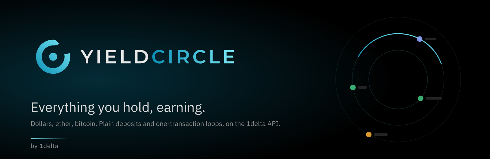

<p align="center"></p>

# YieldCircle

A yield front end on the 1delta API: plain deposits build through
`/v1/actions/earn/deposit`, loops through `/v1/actions/loop/leverage`, and every
call goes through one vendored HTTP boundary. The order of reading is **what do
you want to hold?** first, yield second.

It is also the **social layer**: a feed of what other wallets are doing, a
comment on every strategy, a character for every address and a leaderboard
ranked on yield the index can prove. That half reads two public services —
the position index and the social service — and is described in
[`docs/social.md`](docs/social.md).

```
cp .env.example .env     # VITE_BACKEND_BASE_URL — the credited backend for development
pnpm install
pnpm dev                 # http://localhost:3200
pnpm build               # tsc + vite → dist/
```

Append `?as=0x…` to the URL to read an address's positions without a wallet
(or type it in the wallet dialog). Connect an injected wallet to sign;
set `VITE_WC_PROJECT_ID` for WalletConnect on a phone.

## The idea

Three layers, and the middle one is the unit of account:

| Layer | What it is | Where it comes from |
|---|---|---|
| **Group** | collateral exposure: USD · ETH · BTC · More | `model/assets.ts` |
| **Asset** | the thing you own: USDC, USDT, USDe, USDS, DAI, USDG, avUSD … ETH · WBTC, cbBTC, BTC.b … BNB, AVAX, EURC, XAUt | a whitelist in `model/assets.ts`; wrappers never appear as assets |
| **Strategy** | anything on top of an asset | a **deposit** = one `/v1/data/earn` row (lending market, savings module, LST, PT, curated vault); a **loop** = one `/v1/data/lending/pairs/optimize` row whose collateral resolves to a base asset and whose debt is the same denomination |

So sUSDe is a USDe strategy, syrupUSDC a USDC strategy, wstETH an ETH strategy,
and sUSDe / USDT on Aave is a USDe loop. The resolution is in
`baseOfSymbol` / `baseOfCollateral`: `savings.underlying`, `lst.asset`, the
parenthesised underlying of a PT's name, then the symbol itself.

## What the menu leaves out, and how to see it

The catalogue is **curated**: real size, a collateral that earns on its own, a
carry that pays more than it costs, a risk cap. That is right as a default and
wrong as a wall — on a young chain almost everything is under the floors, and
the list came back empty with nothing on screen admitting that anything had
been left out. HyperEVM on 2026-09-24 read as *zero loops* while the optimizer
had 104 pairs for it.

So every gate now keeps its count (`model/visibility.ts`):

| | |
|---|---|
| **structural** | no switch can show it: an asset outside the whitelist, a debt in another money, a market with no variable borrow, a basket |
| **soft** | a floor in `state/Settings.tsx`: size, borrow liquidity, risk score, rate bets, negative carry, extreme rates |

Under every list is a **not shown** bar: one chip per gate with its count, `+`
moves exactly that floor, `−` puts it back, and the last line counts what no
switch can fix. A row a switch lets in wears the reason it was out
(`thin borrow · $83k borrowable`), so a widened list never reads like a curated
one. The same switches live whole behind the gear in the header.

Two of them change the REQUEST and say so: `minTvlUsd` is the earn listing's
own filter (asking for everything is 3.8 MB on Ethereum against 2.6 MB), and
**wider pair search** drops the optimizer's collateral tags — the archetypes
only return what upstream has tagged, and a token with `props: null` is
invisible to all of them however good it is. On HyperEVM that is the difference
between three pairs and thirty-six, among them `sUSDp/USDC` (9.08 % against
5.70 %) and `syzUSD/USDC`. Everything else is applied to rows already in hand,
so it flips without a round trip.

**Positions follow the same layers.** Group → asset → idle (the wallet balance,
from `/v1/data/token/balances`) + strategies (from `/v1/data/earn/positions`:
vault rows are standalone; a lending account with debt is a loop, one without
is a plain deposit per leg).

## Screens

```
 HOME  #/                          what people are doing
   pulse (one live line) · Yours (a strip, expandable) ·
   HOT RIGHT NOW (markets ranked on how OFTEN and how MUCH) · the stream
        │
 EXPLORER  #/explore                a balance overview
   Your positions: group → asset → idle / strategies (when an address is set)
   One slim block per group: asset rows with balance and "up to x%"
        │ tap an asset
 ASSET PAGE  #/USD?u=USDe&k=loop
   asset chips · idle strip ("$543 USDT idle · could earn up to 6.93%")
   Your positions: value · earning · health · Add / Withdraw or Manage
   Deposits | Loops toggle · one list: strategy · rate · risk
        │ tap a row
 TICKET  (aside on a desk, bottom sheet on a phone)
   ⓘ explanations · amount (+ pay-with and a leverage tier for loops) · the numbers
   what can go wrong · one button → the API's calls, signed one by one
   Say why · who else is in it · the market's thread

 FEED  #/feed?t=following|menu|everyone      one card per TRANSACTION
 WALLET  #/w/0x…      character, badges, NAV, flows, positions, tape, wall
 MARKET  #/m/<uid>    who is in it, the tape, deposits over 30 days, the thread
 BOARD   #/board?t=7d realized yield, ranked
 ME      #/me         the character picker, name, tags, X link
 ALERTS  #/alerts     what the people and markets you follow did
```

Every state is a URL, so back and deep links work. The list stays visible
while the ticket is open. Screenshots against the live API are in
[`docs/shots/`](docs/shots/).

## The social layer

The **home is the activity**, not the catalogue. A table sorted by the biggest
number answers "what pays most" once, and then there is no reason to come
back — so `#/` leads with a live pulse, the markets that are actually busy,
and the stream of moves as they land. The catalogue is one tap away at
`#/explore` and every hot row opens the same ticket it always did.

**"Hot" is two numbers, not one.** Volume alone crowns whichever market one
whale passed through this morning; frequency alone crowns a spray of dust. The
index ranks a market on the geometric mean of its percentile for *how often*
people acted and *how much* they moved — scale-free, and shown as both bars
plus the evidence (`73 moves · 32 wallets · $555k · +64 new`) so the sort is
never a number nobody can check. A $50m single trade and 400 dust trades both
score zero.

Three ideas behind the rest, in [`docs/social.md`](docs/social.md):

- **A post is a position, not a trade.** A deposit does nothing most days, so
  the feed's unit is one *transaction* from the index (`?group=tx`) read as a
  phrase — "opened a loop", "withdrew" — never a list of legs.
- **Say why, at the moment of intent.** The comment box is beside the confirm
  button in the ticket, not on an empty wall. One EIP-712 signature, no gas,
  posted against the strategy's market so the next person choosing it reads it.
- **The score is realized yield, and it is checkable.** `units × Δindex`,
  valued: flows in and out cancel, so adding money never looks like a profit.

Every wallet gets a **character** — six layers of inline SVG derived from the
address, so an un-profiled wallet is still a face and a name ("Amber Otter").
Customising it is a `yc1:` spec signed into the profile; four layers are
**earned** from badges the index mints off the ledger and cannot be claimed.

```
src/index/     the position index   → positions.1delta.io   (read-only, public)
src/social/    threads, profiles, follows, reactions → social.1delta.io
               sign.ts — every write is one EIP-712 message; no sessions
src/identity/  name.ts (ported from pos-indexer), character.tsx
src/model/uid.ts  the join: <lender>:<chainId>:<ref>, the same string everywhere
worker/x-link/    the OAuth worker, because a static site cannot hold a secret
```

Both services are public and send `CORS *`, so nothing here needs a backend.
`VITE_INDEX_BASE_URL` and `VITE_SOCIAL_BASE_URL` point them at a local stack;
Linking an X account is free and needs no developer account: sign a message,
post your address and a code on X, paste the link, and the service reads the
post back through X's public oEmbed endpoint. `VITE_XLINK_URL` adds the
optional OAuth route (`worker/x-link`), which buys X's stable numeric id for
about a cent a link.

**Your own positions never come from the index.** They stay on the live
allocator path — that is the index's own hard rule, and the explorer already
does it. The index is for other wallets and for history.

## What is curated, and how

A simple mode shows a short menu. `model/strategies.ts` decides, in code:

- **Deposits**: base asset only, depositable now, rate between 0.01 % and 25 %,
  at least $2 m in the strategy, API risk score ≤ 4 (only the critical tier is
  hidden). Duplicate (asset, token, venue) rows keep the best one; then the
  top 30 per asset.
- **Loops**: float debt only — a *brokered* market (Lista broker, Midnight
  book, Term repo: `variableBorrowDisabledShort`) needs a term picker the
  simple ticket does not have, but a `fixedTerm` block alone is fine (Lista's
  float-first markets carry one). Collateral that yields on its own (staking,
  savings, PT, fund — never one plain stable against another), debt in the
  same group, ≥ $100 k borrowable, worst risk ≤ 4, net at the suggested
  leverage between 0 and 25 %. Legs are the optimizer's at-size figures
  (quoted at $10 k) when the venue has a depth grid. Top 30 per asset.
- **Leverage as tiers, not a slider.** Defensive, Balanced, Aggressive sit
  at 50 %, 75 % and 90 % of the way up each venue's own range, from 1× to the
  pair's `maxLeverage` as the API reports it: `L = 1 + frac · (max − 1)`. A
  28× venue and a 5× venue therefore get different tiers, and every tier card
  shows the drop-to-liquidation it leaves. Lists quote the Balanced tier. What
  the API offers for this and what it could add is in
  [`docs/leverage-tiers.md`](docs/leverage-tiers.md).
- **"Our pick"**: the best row of its kind on its asset among risk ≤ 2 with
  real size. Data, not editorial.
- **Risk words**: the API's 1–5 score → Low / Medium / High; the listing's
  colour labels are ignored so both listings speak one vocabulary.

The query parameters that do this (`maxRiskScore`, `minTvlUsd`,
`minBorrowLiquidityUsd`, `collateralAmountUsd`, the tag archetypes) live in
`sdk/queries.ts`.

## The ticket

- **Deposit**: amount in the asset; the API builds `approve → deposit` (or one
  call with value for native ETH into an LST). No `payAsset` is sent, so you
  always deposit the row's own asset.
- **Loop**: pay with the collateral or the debt token, whichever the venue
  accepts (`/loop/leverage/pay-assets`) and the wallet holds more of; amount
  in that token; one of three leverage tiers, each showing its net yield,
  leverage and drop-to-liquidation before it is picked. Net yield,
  yearly, hold / owe, the liquidation buffer in words, rate sensitivity, and
  the API's projected entry cost and simulated health from a live quote.
- **Get the asset from anywhere.** Under the amount, one line: "Don't have
  enough USDe? Get it from anything you hold, on any chain". It opens an
  inline panel (`ui/GetAsset.tsx`): pick one of your balances across
  Ethereum, Base, Arbitrum and BNB (biggest first), the amount is prefilled
  with the shortfall, the API quotes the best route (spot swap on the same
  chain, bridge aggregation across chains: `/v1/actions/swap/spot`,
  `/v1/actions/swap/x-chain`) and one button approves and sends. Bridges
  are polled on `/v1/data/bridge/status`; on arrival the balance refreshes
  and the ticket carries on. The quote line itself ("You get ~993 USDe ·
  via Fly · ~3 min · best of 5 ▾") is the only route control: tapping it
  unfolds the other routes as a quiet list (name, output bar, output, bp
  behind the best, time) and picking one folds it back. The same endpoints
  as a full swap terminal, with the choices made for you.
- **Execution** (`ui/useLadder.ts`): permissions → setup → exactly one route,
  each mined before the next, mirrored to `sessionStorage` so a phone's wallet
  hand-off survives. The wallet is switched to the row's chain first.

## Layout

```
src/
  config/backend.ts        base URL + apiHeaders() — the fork's auth hook
  vendor/allocator/http.ts the one place that talks to the backend — attach a key or a proxy here
  sdk/                     api.ts (one function per endpoint), types.ts, queries.ts (React Query hooks)
  model/                   assets.ts (groups, base-asset whitelist, wrapper resolution), strategies.ts
                           (earn row → deposit, optimizer row → loop, curation), positions.ts
                           (positions → group / asset / idle / strategies), leverage.ts (pure math)
  state/AppState.tsx       chain selection, hash routing, account / view-as
  ui/                      Shell, Explorer, AssetPage, Ticket, useLadder, useBook (all data for a screen), bits
  wallet/                  wagmi config (injected + optional WalletConnect), ConnectButton
  styles/app.css           the mockup's stylesheet, plus a few app classes
brand/gen.py               the mark (an open turn of yield), the YIELD·CIRCLE lockup, og card and README
                           banner, all as paths; `pnpm brand` regenerates public/ icons and docs/banner.*
                           (needs python3 + fontTools; resvg for the PNGs)
docs/simplify.md           why the asset page is one list with a toggle
```

## Deploy (Cloudflare Pages)

Static Vite build, no server, no secrets in the bundle (the API base URL is
public). Hash routing, so no `_redirects` rule is needed.

**From your machine (wrangler)**
```bash
npx wrangler login                                                   # once
npx wrangler pages project create yieldcircle --production-branch main   # once
VITE_BACKEND_BASE_URL=https://allocator.api.1delta.io pnpm deploy    # build + upload
pnpm deploy:preview                                                  # a preview-branch URL
```

**Git integration (Pages builds on push)**: Cloudflare dashboard → Workers &
Pages → Create → Pages → connect `1delta-DAO/yieldcircle`, then:

| Setting | Value |
|---|---|
| Production branch | `main` |
| Framework preset | None (or Vite) |
| Build command | `VITE_SITE_URL=${VITE_SITE_URL:-$CF_PAGES_URL} pnpm build` |
| Build output directory | `dist` |
| Root directory | `/` |
| Environment variable | `VITE_BACKEND_BASE_URL=https://allocator.api.1delta.io` |
| Environment variable | `VITE_SITE_URL=https://yieldcircle.io` — **Production only** |
| Environment variable | `NODE_VERSION=22` |

`VITE_SITE_URL` is only read by four `<head>` tags — canonical, `og:url`,
`og:image`, `twitter:image` — so the app runs without it. It does not
*degrade* without it though: Vite leaves the literal `%VITE_SITE_URL%` in the
HTML, which makes `og:image` a relative path, and a relative OG image means
**no preview card when anyone shares a link**. On a social app that is the
one piece of metadata worth getting right. The build command above is why
it is written that way: production uses the variable, and every preview
deployment falls back to its own `CF_PAGES_URL`, so a branch build is never
shipped with a broken card.

**Set it under Production only.** With a custom domain on top, `pages.dev`
keeps serving the same site, and the canonical tag is what tells a crawler
which of the two counts — so production must claim `https://yieldcircle.io`.
A preview that claimed the same thing would be telling Google that the
preview *is* the production page; leaving the variable unset on Preview makes
each one name itself instead. Attach the domain before setting it, or the
first build points its canonical and OG image at a host that does not resolve
yet.

Nothing else in the app is host-dependent: neither API has an origin
allowlist to update (both send `CORS *`), WalletConnect's metadata reads
`location.origin`, and `og.png` is served from the site root.

The social layer needs **no variables**: `VITE_INDEX_BASE_URL` and
`VITE_SOCIAL_BASE_URL` already default to `https://positions.1delta.io` and
`https://social.1delta.io`, and both send `CORS *`. Set them only to point a
build at a local stack. `VITE_XLINK_URL` is likewise optional — without it,
linking an X account uses the free post-proof route, which needs nothing.

Pages installs with pnpm when it sees `pnpm-lock.yaml` (this lockfile is v9,
so it wants pnpm 9+; if the build image picks an older one, add
`PNPM_VERSION=9`). Optional:
`VITE_WC_PROJECT_ID` for WalletConnect on phones.

**`VITE_*` variables are baked in at build time.** Set them under *both*
Production and Preview before the first build; a variable added afterwards
only takes effect on the next deployment (Deployments → ⋯ → Retry deployment,
or push a commit). If the app shows "The listing could not be loaded from
portal.1delta.io: Too many requests", the build ran without the variable and
is on the public, per-IP rate-limited endpoint.

## Known gaps

- **Manage a loop with one slider** (`ManageLoop`): the target leverage,
  from "close" (1×) to the venue maximum, with Close / tier / Now snaps.
  Left of the current leverage is a deleverage: collateral is sold into the
  debt token and that much debt repaid (`/v1/actions/loop/close`, `isAll`
  at 1× — everything sold, the rest returned as the debt token). Right of
  it borrows more and buys more collateral with no new margin
  (`/v1/actions/loop/leverage` as a pure leverage step). The cells show net
  yield, hold, owe, health and buffer *after*, against *now*. Withdraw on a
  deposit builds `/v1/actions/earn/withdraw`. Positions the catalogue has no
  row for (an old Aave V2 deposit) are listed but not actionable here. A loop
  is matched to its catalogue row by both legs.
- Deposits with a different pay asset (USDT into a USDC market) are supported
  by the API but not offered here; the idle strip only ever points at the
  asset's own strategies.
- Some lenders (LlamaLend) refuse a quote without an account, so the entry
  cost cell reads "no quote" until an address is set.
- With "All" selected the app reads Ethereum, Base, Arbitrum, BNB Chain and
  Avalanche; other chains the API knows are not offered. BNB, AVAX and their
  staking wrappers (slisBNB, BNBx, ankrBNB, sAVAX, ggAVAX) sit in the "More"
  group, as do the euro and gold.
- **"More" is a drawer, not a denomination.** A loop is only carry when both
  legs are the same *money*, so the pair test is `sameMoney` in
  `model/assets.ts` (`denomOf`) and not the display group — otherwise sAVAX
  against EURC reads as a carry when it is a bet on AVAX against the euro. The
  optimizer really does return that row.
- Brokered fixed-term markets (Lista broker, Midnight, Term) are not listed:
  the ticket has no term picker yet.
